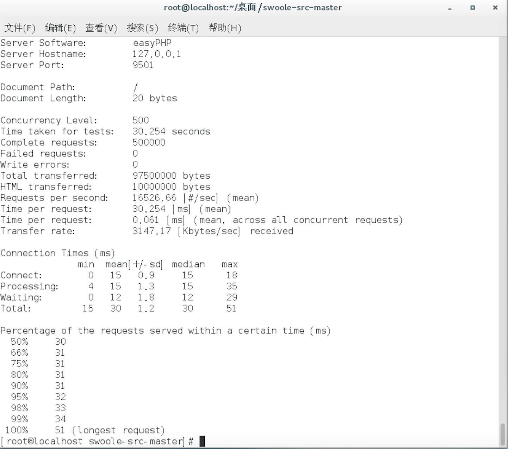

#easyPHP-Swoole
### 本项目基于easyPHP与Swoole拓展实现

##### [easyPHP](https://github.com/kiss291323003/easyPHP): https://github.com/kiss291323003/easyPHP
##### [Swoole](http://www.swoole.com/): http://www.swoole.com/

easyPHP-Swoole 专为API而生，是一款常驻内存化的PHP开发框架，摆脱传统PHP运行模式在进程唤起和文件加载上带来的性能损失，自带服务器功能，无需依赖Apache或Nginx运行。在web服务器模式下，支持多层级(组模式)控制器访问与多种事件回调,高度封装了Swolle Server 而依旧维持Swoole Server原有特性，支持在 Server 中监听自定义的TCP、UDP协议，让开发者可以最低的学习成本和精力，编写出多进程，可定时，可异步，高可用的应用服务。

#### 优势:

   - 简单易用开发效率高
   - 并发百万TCP连接
   - TCP/UDP/UnixSock
   - 支持异步/同步/协程
   - 支持多进程/多线程
   - CPU亲和性/守护进程
   
#### 关于ab基准测试：

- 系统: CentOS 7.1 桌面版
- CPU: i5 6500
- 内存: 8G
- php: 5.6.30
- Swoole: 1.8.13-stable
- 测试代码: Index控制器中输出"hello world"并发送header "X-Server"=>""easyPHP"

## 主要特性:

#### 维持了Swoole Server中的全部特性：

 - 强大的TCP/UDP Server框架，多线程，EventLoop，事件驱动，异步，Worker进程组，Task异步任务，毫秒定时器，SSL/TLS隧道加密。
 - EventLoop API，让用户可以直接操作底层的事件循环，将socket，stream，管道等Linux文件加入到事件循环中。
#### 维持了easyPHP中的全部特性
 - 高度全局化请求对象与响应对象封装，方便二次开发。
 - 支持快速路由,请求拦截,多种事件回调，容器托管服务。
# 项目文档

## 环境要求
- php 版本大于等于 5.6
- Swoole 拓展版本大于等于 1.8.13
+ 系统依赖:
    + 仅支持Linux,FreeBSD,MacOS 这三类操作系统。
    + Linux内核版本2.3.32以上
    + 若在 CygWin环境(Windows)下使用，请务必关闭Swoole配置文件的 daemonize 选项
    
> 建议使用Ubuntu14/CentOS 6.5或更高版本操作系统

## 编程须知

### 注意事项
- 不要在代码中执行sleep以及其他睡眠函数，这样会导致整个进程阻塞
- exit/die是危险的，会导致worker进程退出
- 可通过register_shutdown_function来捕获致命错误，在进程异常退出时做一些请求工作。
- PHP代码中如果有异常抛出，必须在回调函数中进行try/catch捕获异常，否则会导致工作进程退出
-  swoole不支持set_exception_handler，必须使用try/catch方式处理异常
- Worker进程不得共用同一个Redis或MySQL等网络服务客户端，Redis/MySQL创建连接的相关代码可以放到onWorkerStart回调函数中。
### 类/函数重复定义
- 新手非常容易犯这个错误，由于easyPHP-Swoole是常驻内存的，所以加载类/函数定义的文件后不会释放。因此引入类/函数的php文件时必须要使用include_once或require_once，否会发生cannot redeclare function/class 的致命错误。
### 内存管理
 - PHP守护进程与普通Web程序的变量生命周期、内存管理方式完全不同,后面会有详细说明，编写常驻进程时需要特别注意。

### 进程隔离
 进程隔离也是很多新手经常遇到的问题。修改了全局变量的值，为什么不生效，原因就是全局变量在不同的进程，内存空间是隔离的，所以无效。所以使用easyPHP-Swoole开发Server程序需要了解进程隔离问题。
 - 不同的进程中PHP变量不是共享，即使是全局变量，在A进程内修改了它的值，在B进程内是无效的
 - 如果需要在不同的Worker进程内共享数据，可以用Redis、MySQL、文件、Swoole\Table、APCu、shmget等工具实现
 - 不同进程的文件句柄是隔离的，所以在A进程创建的Socket连接或打开的文件，在B进程内是无效，即使是将它的fd发送到B进程也是不可用的
 - 进程克隆。在Server启动时，主进程会克隆当前进程状态，此后开始进程内数据相互独立，互不影响。有疑问的新手可以先弄懂php的pcntl
 
## 约定规范
- 项目中类名称与类文件(文件夹)命名，均为大驼峰，变量与类方法为小驼峰。
- 若用easyPHP-Swoole写HTTP API(网页)服务，控制器搜索路径(名称空间前缀)为""App/Controller"。
- easyPHP-SWoole中类文件全部为自动加载，支持动态名称空间加载与文件引入。若需添加第三方包(项目)，可以在Conf/Event中的frameInitialize方法获取AutoLoader实例引入,或在对应的业务逻辑代码中引入。
- 在HTTP相应中，于业务逻辑代码中echo $var 并不会将$var内容输出至相应内容中，请调用Response实例中的wirte()方法实现。
- 框架核心对象生命周期(单例对象)：
    + Core 实例生命周期与Server生命周期一致，请勿在业务代码中尝试手动创建或获取使用。
    + Dispatcher 实例生命周期与对应所在的Worker生命周期一致，请勿在业务代码中尝试手动创建。
    + Request与Response对象存在于整个Http的请求-响应周期中，收到用户请求自动创建，响应结束后自动销毁，请勿自行创建，若需获取对应实例，请用Response::getInstance()或Request()::getInstance()获取对应实例。
    + AutoLoader 当执行了框架初始化后，AutoLoader实例将会一直存在直至整个Server关闭,请勿自行创建。需要获取AutoLoader实例请以 AutoLoader::getInstance()方式获得。
    + Config 实例生命周期与Server生命周期一致，请勿在业务代码中尝试手动创建，需要获取对应实例请以Config::getInstance()方式获得。
    + Event
    
## 基础入门
 ### 配置文件
 所有配置均在Conf/Config.php init()方法 中以数组的形式存在于系统中。获取配置请用Config实例的get()方法实现。
  - 系统配置($sysConf)
    + SERVER : Swoole配置选项，详情请见[配置](https://wiki.swoole.com/wiki/page/274.html)
    + DEBUG : ENABLE 是否开启Debug模式。LOG 是否记录日志。DISPLAY_ERROR 是否显示错误。
  - 用户配置($userConf)
    + 用户可以自定义添加配置信息。
 ### 事件回调
 以下为常用回调事件，更多Swoole回调事件请看[事件回调](https://wiki.swoole.com/wiki/page/41.html)
   - frameInitialize
   - beforeWorkerStart
   - onStart
   - onShutdown
   - onWorkerStart
   - onWorkerStop
   - onRequest
   - onDispatcher
   - afterResponse
   - onTask
   - onFinish
   - onWorkerError
   - onWorkerFatalError
 ### 控制器
 
 ### 服务启动
 